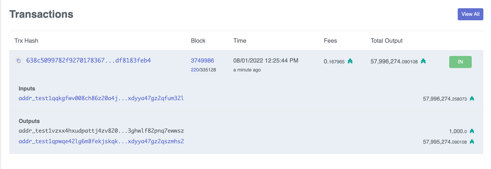

# Key pair

The key pair consists of:

-   Private key (signature) ⟶ .skey
-   Public key (verification) ⟶ .vkey

# Socket

Recall that if you want to run cardano-cli commands on-chain, you need to export the path variable on the current shell:

    export CARDANO_NODE_SOCKET_PATH=/Users/antonio/code/haskell/emurgo/testnet/node.socket

*Note:*  Cardano socket is created automatically when you start the Cardano node for the first time.

# Testnet magic

Current *Testnet magic* is `1097911063`

# Protocol parameters

We query the *testnet* protocol parameters and save them on a file on the testnet directory.

    $ cardano-cli query protocol-parameters --testnet-magic 1097911063 --out-file ~/code/haskell/emurgo/testnet/testnet-protocol-params.json

# Addresses

-   "Enterprise" addresses (only for payment)
-   Payment + Staking
-   KES address ("evolutionary", stake pool operators need to renew every 90 d)

-   External with staking
-   Internal with staking
-   External without staking
    
    All addresses are derived from hashing the public key.

## Generating credentials

### Generating key pair

    $ cardano-cli address key-gen --verification-key-file myWallet1.vkey --signing-key-file myWallet1.skey
    $ 
    $ ls
    myWallet1.skey  myWallet1.vkey

### Generating address

    $ cardano-cli address build --payment-verification-key-file myWallet1.vkey --testnet-magic 1097911063 --out-file myWallet1.addr
    $ ls
    myWallet1.addr  myWallet1.skey  myWallet1.vkey
    $ 
    $ # For curisoity, generate mainnet address (which we will not use)
    $ cardano-cli address build --payment-verification-key-file myWallet1.vkey --mainnet --out-file myWallet1M.addr
    $ ls
    myWallet1.addr  myWallet1.vkey  myWallet1.skey  myWallet1M.addr

## Querying a wallet address

    $ pwd
    /Users/antonio/code/haskell/emurgo/priv
    $ 
    $ cardano-cli query utxo --address $(cat myWallet1.addr) --testnet-magic 1097911063                           TxHash                                 TxIx        Amount
    --------------------------------------------------------------------------------------
    638c5099782f9270178367178ffffeb077f921cefe670612b1ea99df8183feb4     0        1000000000 lovelace + TxOutDatumNone

### Can verify funds at [Cardanoscan (testnet)](https://testnet.cardanoscan.io)

# Transactions

## Building the transaction

### Script

File `tx_draft.sh` 

    cardano-cli transaction build \
    	    --babbage-era \
    	    --testnet-magic 1097911063 \
    	    --tx-in 638c5099782f9270178367178ffffeb077f921cefe670612b1ea99df8183feb4#0 \
    	    --required-signer myWallet1.skey \
    	    --tx-out $(cat myWallet2.addr)+"300000000 lovelace" \
    	    --change-address $(cat myWallet1.addr) \
    	    --protocol-params-file ../testnet/testnet-protocol-params.json \
    	    --out-file tx.draft

    $ chmod u+x tx_draft.sh 

### Execution

    $ ./tx_draft.sh
    Estimated transaction fee: Lovelace 171573
    $ 
    $ # which produces:
    $ cat tx.draft
    {
        "type": "TxBodyBabbage",
        "description": "",
        "cborHex": "86a40081825820638c5099782f9270178367178ffffeb077f921cefe670612b1ea99df8183feb4000182a200581d608c6adcdc687ab5caa261d4f7ce7156d83b90860e7638a2eefa4ea0cc011a29b688cba200581d600852c087a3e75a4ff877cd08b47027eac946f32cb72cde805da230f1011a11e1a300021a00029e350e81581c8c6adcdc687ab5caa261d4f7ce7156d83b90860e7638a2eefa4ea0cc9fff8080f5f6"
    }

## Signing the transaction

### Script

File `tx_signed.sh` 

    cardano-cli transaction sign \
    	    --tx-body-file tx.draft \
    	    --signing-key-file myWallet1.skey \
    	    --testnet-magic 1097911063 \
    	    --out-file tx.signed

    $ chmod u+x tx_signed.sh 

### Execution

    $ ./tx_signed.sh
    $
    $ # which produces:
    $ cat tx.signed
    {
        "type": "Tx BabbageEra",
        "description": "",
        "cborHex": "84a40081825820638c5099782f9270178367178ffffeb077f921cefe670612b1ea99df8183feb4000182a200581d608c6adcdc687ab5caa261d4f7ce7156d83b90860e7638a2eefa4ea0cc011a29b688cba200581d600852c087a3e75a4ff877cd08b47027eac946f32cb72cde805da230f1011a11e1a300021a00029e350e81581c8c6adcdc687ab5caa261d4f7ce7156d83b90860e7638a2eefa4ea0cca100818258207fd4a6131432173c843689d13c64b3e616671efa411fb5a812450a28c9ff3088584022abcef02b26e7e8f91bea7ff98b2e6018cd4833998693d190019ff7b6f5fd9091318294b6b27f55a098e44b28d7c3061369762de43f8e7952168ce743a52d08f5f6"
    }

## Submitting the transaction

We first query the utxo's at wallet 2 **before** the transaction:

    $ cardano-cli query utxo --address $(cat myWallet2.addr) --testnet-magic 1097911063                                                              
    			   TxHash                                 TxIx        Amount
    --------------------------------------------------------------------------------------

Submit the transaction:

    $ cardano-cli transaction submit --testnet-magic 1097911063 --tx-file tx.signed
    Transaction successfully submitted.

## Final balances

Query the utxo's at wallet 2 **after** the transaction:

    $ cardano-cli query utxo --address $(cat myWallet2.addr) --testnet-magic 1097911063       
    			   TxHash                                 TxIx        Amount
    --------------------------------------------------------------------------------------
    30eea3e9228b94cad0cbfb131f65ebf3e9d5b24820394dca8408920037797e64     1        300000000 lovelace + TxOutDatumNone

Of course, the balance of wallet 1 must have diminished:

    $ cardano-cli query utxo --address $(cat myWallet1.addr) --testnet-magic 1097911063                                                                                 TxHash                                 TxIx        Amount                                                                                             
    --------------------------------------------------------------------------------------
    30eea3e9228b94cad0cbfb131f65ebf3e9d5b24820394dca8408920037797e64     0        699828427 lovelace + TxOutDatumNone

# Some useful links

-   [Faucet](https://testnets.cardano.org/en/testnets/cardano/tools/faucet/)
-   [Documentation about some *Guild Tools* (Guild LiveView)](https://cardano-community.github.io/guild-operators/)

